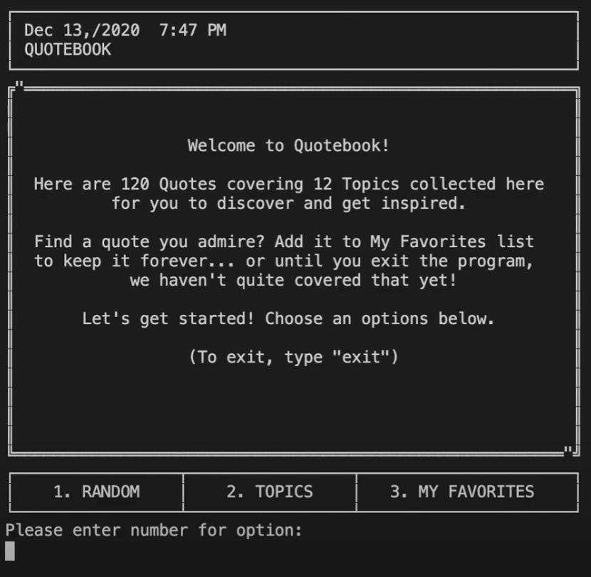

# Quotebook

> “Quotes help us understand, inspire, motivate, 
> clarify and show our approach to things around,
> this is why people and I love quotes.”
>
> — Takyou Allah Cheikh Malaynine

This is Quotebook, a CLI program that takes quotes from QuoteGarden REST API and organizes by twelve different topics.
Users can browse through the different topics and find quotes that inspire them. Want to be surprised? Quotebook can generate a random quote for extra inspiration.

[Click here for Youtube tutorial](https://youtu.be/B18DGhvesYc)

## Prerequisites

* [Bundler](https://bundler.io/)

`$ gem install bundler`

## Installation

1. To install locally, clone this [repository](https://github.com/codymerritt347/quotebook)
2. Navigate into project root folder
3. Bundle application:

`$ bundle install`

## Deployment

In your terminal, run the following:

`./bin/run_quotebook`

You're ready to collect quotes!

## Usage

Once the main menu is loaded, you'll be greeted with a welcome message and options for generating a random quote, browse the twelves topics, or see what quotes you've collected as favorites. To access any of the menu options, type the number corresponding to the wanted option. From the main menu, type 'exit' to leave the program.

## License

The gem is available as open source under the terms of the [MIT License](https://choosealicense.com/licenses/mit/).