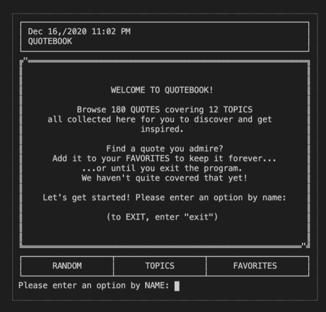
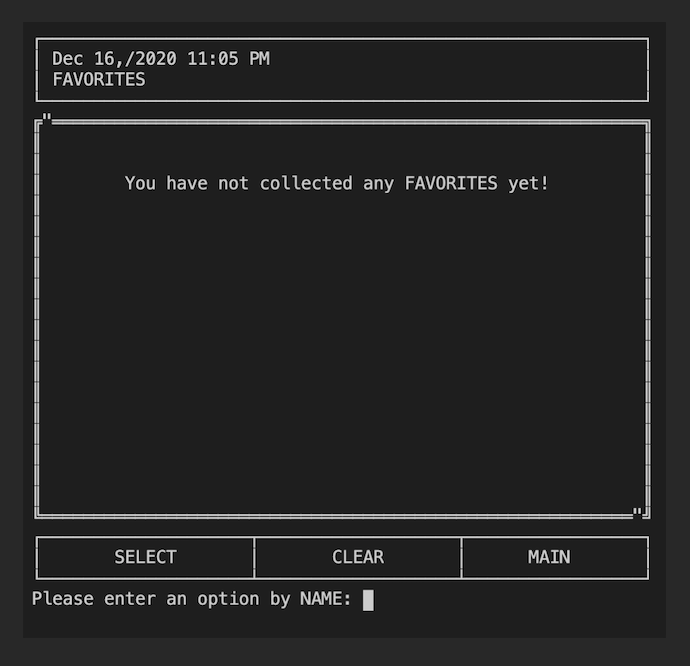

# Quotebook

> “Quotes help us understand, inspire, motivate, 
> clarify and show our approach to things around,
> this is why people and I love quotes.”
>
> — Takyou Allah Cheikh Malaynine

This is Quotebook, a CLI program that takes quotes from QuoteGarden REST API and organizes by twelve different topics.
Users can browse through the different topics and find quotes that inspire them. Want to be surprised? Quotebook can generate a random quote for extra inspiration.

[Click here for Youtube tutorial](https://youtu.be/B18DGhvesYc)

## Prerequisites

* [Bundler](https://bundler.io/)

`$ gem install bundler`

## Installation

In your terminal:
1. [[Clone this repository]](https://github.com/codymerritt347/quotebook)
2. Navigate into project ROOT FOLDER "quotebook/"

### Mac Users!

There is a branch that contains added functionality!
Enter `$ git checkout mac_speak` before deployment if interested.
(This branch adds system Dictation capabilities!)

## Deployment

In your terminal:
```
$ bundle install
$ ./bin/run_quotebook
```

## Usage

In the MAIN MENU, you'll be greeted with a welcome message and options for discovering a RANDOM quote; browsing quotes ranging across twelve TOPICS; and accessing your FAVORITES, a collection of bookmarked quotes to which you can add and edit.

## Screenshots




## License

The gem is available as open source under the terms of the [MIT License](https://choosealicense.com/licenses/mit/).